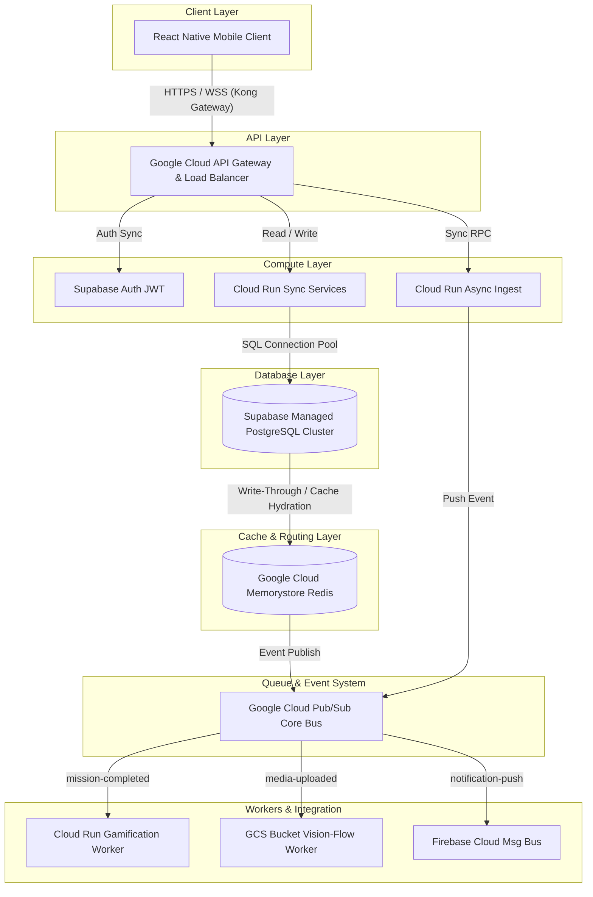
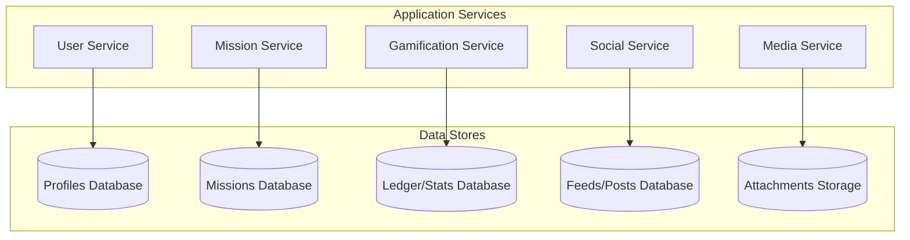

# Comprehensive Architectural Blueprint and System Design for the Civic Campus Platform

## 1. System Understanding and Core Challenges

The Civic Campus Platform is a gamified, multi-tenant mobile and backend infrastructure designed to cultivate civic engagement, community service, and democratic awareness among college students. The application gamifies civic engagement through daily missions, educational micro-lessons, verified photo proofs, and real-time comparative leaderboards.

### Core Engineering Challenges
- **Transactional Integrity:** Maintaining strict transactional integrity in gamified metrics under high concurrency. Experience points (XP), reward balances, and daily streaks must be modified with ACID guarantees to prevent race conditions or duplicate point-scoring vectors.
- **Real-Time Leaderboards:** Scaling real-time comparison structures for global, regional, campus, and department leaderboards with $O(\log N)$ complexity without causing performance issues or relying on traditional `ORDER BY` operations.
- **Media Ingestion & Validation:** Managing high-volume image uploads for mission validation, requiring concurrent processing, metadata extraction, content moderation, and state updates without blocking API threads.
- **Multi-Tenant Scale:** Supporting multi-tenant scale across thousands of distinct college campuses and departments with strict data boundaries and tenant isolation.

---

## 2. High-Load Scaling Projections

The system architecture is designed to handle three distinct growth phases:

| Scale Parameter | Phase 1: MVP | Phase 2: National Scale | Phase 3: Global Scale |
| :--- | :--- | :--- | :--- |
| **Monthly Active Users (MAU)** | 1,000 | 100,000 | 1,000,000 |
| **Daily Active Users (DAU)** | 700 | 70,000 | 700,000 |
| **Peak Concurrent Users (PCU)** | 100 | 7,000 | 70,000 |
| **Peak Write Requests / Sec** | 10 RPS | 500 RPS | 5,000 RPS |
| **Peak Read Requests / Sec** | 50 RPS | 2,500 RPS | 25,000 RPS |
| **Daily Media Upload Volume** | 200 Images | 20,000 Images | 200,000 Images |
| **Total Database Storage / Month**| 5 GB | 500 GB | 5 TB |

---

## 3. High-Level Architecture Design

The platform uses a modular backend architecture deployed on Google Cloud Run, backed by a managed Supabase PostgreSQL cluster and an in-memory Redis layer.

### Sync vs. Async Flow Classification

| Synchronous Operations (< 80ms) | Asynchronous Operations |
| :--- | :--- |
| User Sign-In & JWT Auth Validation | Gamification Metric & Tier Processing |
| Static Educational Content Delivery | Machine Learning Content Moderation |
| Direct Post Creation and Comment Submission | Notification Dispatch & Dynamic Target Sweeps |
| Immediate Profile Queries | Long-Term Data Warehousing Pipelines |

---

## 4. Core Services Breakdown

### 1. User Service
- **Role:** Manages user profiles, identity setup, and department alignments.
- **Storage:** `public.profiles`, `public.colleges`, `public.departments`.
- **Scaling Strategy:** Highly read-optimized via Redis caching and stateless Cloud Run horizontally scaled instances.

### 2. Mission Service
- **Role:** Structures, serves, and tracks daily tasks, quizzes, and educational modules.
- **Storage:** `public.missions`, `public.user_missions`, `public.lessons`.
- **Scaling Strategy:** Write-decoupling using append-only logs in Postgres and offloading validations via Pub/Sub.

### 3. Gamification Service
- **Role:** Tracks scores, XP, streaks, badges, and civic titles.
- **Storage:** `public.civic_ledger`, `public.user_streaks`, `public.badges`.
- **Scaling Strategy:** State-driven architecture triggered by Pub/Sub events with database-level row locks.

### 4. Social / Feed Service
- **Role:** Manages campus social feeds, group challenges, and comments.
- **Storage:** `public.posts`, `public.comments`, `public.reactions`.
- **Scaling Strategy:** Hybrid write-fan-out model. High-activity feeds pre-cached in Redis.

### 5. Notification Service
- **Role:** Coordinates pushed alerts, in-app messaging, and automated reminder loops.
- **Storage:** `public.user_devices`, `public.notification_preferences`.
- **Scaling Strategy:** Decoupled Pub/Sub event streams handled by background Cloud Run workers.

### 6. Media Service
- **Role:** Secure direct-to-bucket media uploads and file management.
- **Storage:** `public.media_attachments`, Google Cloud Storage.
- **Scaling Strategy:** Client-side direct GCS uploads via pre-signed URLs.

### 7. Analytics Service
- **Role:** Aggregates system metrics, behavioral shifts, and generates reports.
- **Storage:** Google BigQuery (via CDC), `public.analytics_aggregates`.
- **Scaling Strategy:** Log-based Change Data Capture (CDC) streaming to BigQuery.

---

## 5. Critical System Workflows & Detailed Design

### 5.1. Daily Mission Engine
Selects personalized missions based on user focus areas, levels, and past completions to prevent repetition.
- **Read Path:** Checks Redis (`user:id:daily`). On cache miss, queries Postgres (excluding last 7 days), writes to Redis with 24-hour TTL, and returns mission.
- **Edge Cases:** Validates timezone localized limits to prevent midnight dynamic shifts. Handles concurrent cycles using database transactions.

### 5.2. Civic Score System
Calculates a rolling score (0-100) reflecting real-world engagement with decay for inactivity.
- **Equation Factors:** Weights by category (e.g., Governance 0.25), 30-day aggregate completions, streak modifiers (up to 10 points), and a time-decay factor (0.5 points/day after 3 inactive days).
- **Update Workflow:** Gamification payload triggers a `SELECT FOR UPDATE` on the user profile, recalibrating the score inside a single transaction.

### 5.3. Real-Time Leaderboard System
Leverages Redis Sorted Sets (`ZSET`) to ensure low-latency $O(\log N)$ updates.
- **Data Structures:** Split across `leaderboard:global`, `leaderboard:campus:<uuid>`, etc.
- **Tie-Breaking:** Fractional timestamp values are added to the user's score in Redis to ensure first-come, first-served fair ranking.
- **Batching:** Redis commands are batched via pipelines to update multiple structural tiers (Global, Campus, Dept) simultaneously.

### 5.4. Photo Upload and Validation Pipeline
Offloads image processing to ensure the primary API is not blocked.
- **Upload Flow:** Client requests Pre-Signed URL → Client uploads directly to GCS Bucket.
- **Event Flow:** GCS Object Creation Event → Pub/Sub → Cloud Run ML Worker → Google Cloud Vision (SafeSearch/Labels) → Database Update.
- **Moderation:** Missing EXIF falls back to client GPS. Inappropriate content flagged by Vision API queues submission for administrative review.

---

## 6. Database Architecture & Optimization

Core data store is a managed **PostgreSQL cluster on Supabase** structured for referential integrity.

### Data Partitioning and Indexing
- **Audit Logs:** Partitioned natively by date ranges (`PARTITION BY RANGE`).
- **Indexes:**
  - B-Tree indexes on `(college_id, civic_score DESC)` for efficient local queries.
  - Partial indexes (`WHERE current_streak > 0`) for rapid active streak evaluations.
  - GIN indexes (`USING gin`) on JSONB payloads (e.g., extracted media labels).

### Read vs. Write Optimization
- **CQRS Decoupling:** Heavy analytical aggregations are processed on Read Replicas.
- **Row-Level Security (RLS) Guarding:** Columns utilized in RLS logic (like `college_id`) are indexed to bypass full table scans.

---

## 7. Scalability and System Evolution

To accommodate growth up to 1,000,000 MAU, the platform architecture will iteratively evolve:

### Phase 1 (MVP: 1K Users)
- **Compute:** Single Cloud Run container handles all API routing.
- **Leaderboards:** Basic transactional SQL aggregations.
- **Database:** Standard Supabase Postgres instance.

### Phase 2 (National Scale: 100K Users)
- **Compute:** Decoupled functional microservices running on Cloud Run.
- **Leaderboards:** Redis (Memorystore) Cache-aside instance for rankings.
- **Database:** Split read-write architecture with dedicated read replicas. Pub/Sub integrated.

### Phase 3 (Global Scale: 1M Users)
- **Compute:** Cloud Run containers spanning multi-region clusters with global load balancing.
- **Leaderboards:** Federated Redis Nodes and regional cluster configurations.
- **Database:** Partitioned database tables based on campus grouping, utilizing Log-Based CDC to BigQuery.

### Mitigated Bottlenecks
- **Connection Depletion:** Prevented by using Supabase's built-in PgBouncer connection pooler to prevent Node.js from draining pool limits.
- **Cold Start Latency:** Serverless container cold starts mitigated by enforcing minimum instance limits on critical customer-facing API routes.
